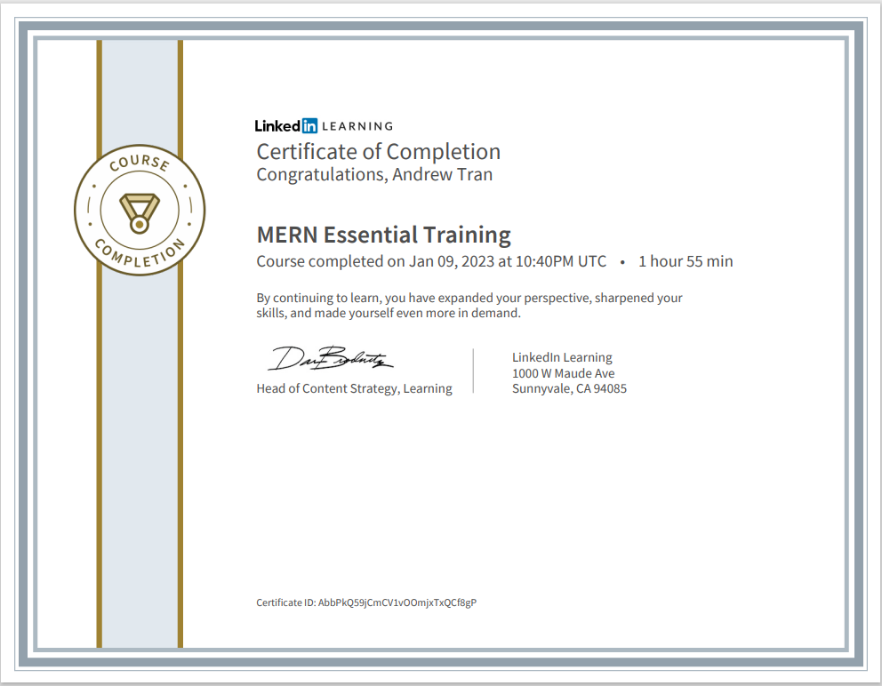

## MERN-Essentials-LinkedIn-Course

-In this following repository, I have attached all of the files that I had used when I was going through the 'MERN-Essential-Training' LinkedIn Course in January 2023. Below, here is my certification showing my completion of the LinkedIn Course: 

  

  

-Link to "MERN Essential Training" LinkedIn Learning Course: [here](https://www.linkedin.com/learning/mern-essential-training/learn-all-about-mern?autoplay=true&u=57888345)

-Link to MongoDB Documentation: [here](https://www.mongodb.com/docs/)

-Link to Express.js Documentation: [here](https://expressjs.com/)

-Link to React.js Documentation: [here](https://reactjs.org/)

-Link to Node.js Documentation: [here](https://nodejs.org/)